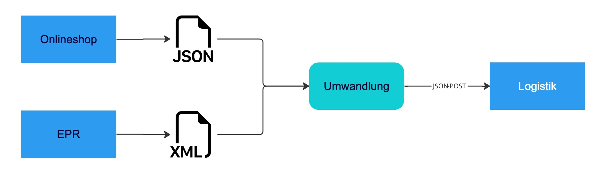

# Order-Translator Schulprojekt

Mit diesem Projekt soll ein Service erstellt werden, welcher Aufträge aus verschiedenen Quellsystemen (Onlineshop, ERP)
entgegennimmt und diese an die Logistik zur Auslieferung überträgt.

## Aufgabenstellung

In der Logistik werden Aufträge aus verschiedenen Quellsystemen bearbeitet. Diese Quellsysteme exportieren die Aufträge
in unterschiedlichen Formaten:

* Die Aufträge des Onlineshops sind im JSON-Format ([Beispiel](data/auftrag_onlineshop.json))
* Die Aufträge aus dem EPR-System liegen im XML-Format vor ([Beispiel](data/auftrag_erp.xml))

Das Logistiksystem verlangt die Aufträge in einem einheitlichen Format. Das Format ist in
dieser [Datei](data/logistik/input_schema.json) als JSON-Schema beschreiben.
Eine [Beispiel-Datei](data/logistik/beispiel_input.json) für den Request liegt ebenfalls vor.
Mit [diesem Online-Tool](https://www.jsonschemavalidator.net/s/GBmB5hf7) lassen sich die Daten gegen das Schema testen
Die Daten müssen dem System per REST-Request mit der Methode Post übergeben werden. Dafür existiert eine Test-API welche
wir eingerichtet haben. Der Zugang wird den Projektteilnehmern bereitgestellt.




## Wie starten wir?

1. Nachdem ihr einen persönlichen GitHub-Account erstellt habt, könnt ihr dieses Repository forken. Damit legt ihr
   eine "verbundene" Kopie auf euren Account.
2. Diese Kopie könnt ihr das Repository jetzt von eurem Account auschecken (runterladen)
3. Jetzt könnt ihr lokal entwickeln und die Änderungen anschließend auf euren Account pushen (hochladen)
4. Wenn ihr mit eurem Ergebnis zufrieden seid, reicht ihr einen Pull-Request ein. Damit kann der Code aus von eurem
   GitHub-Account in das Repository im simplicity-GitHub-Account übertragen werden.

## Lesson 01

Das Programm soll über die Kommandozeile gestartet werden. Dazu soll der Einstiegspunkt erstellt werden, welche uns zuerst nur mit einem Hallo begrüßt.

### Lösung

Wir rufen das [Script](main.py) über die Kommandozeile mit dem Befehl `python3 main.py` auf:

Ausgabe:
```
$ python3 main.py

> Hallo
```

